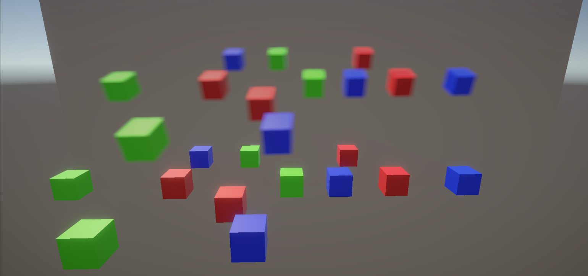

# CameraToTextureRenderPassFeature

## Overview

`CameraToTextureRenderPassFeature` is a custom `ScriptableRendererFeature` for Unity's Universal Render Pipeline (URP). It allows you to render the output of a camera to a `RenderTexture` and optionally apply a material to the rendered image.

## Features

- **Render to Texture**: Capture the output of a camera and render it to a specified `RenderTexture`.
- **Material Application**: Apply a material to the rendered image for post-processing effects.
- **Camera Filtering**: Filter which cameras are affected by the feature using camera tags and camera types.
- **Dynamic Resizing**: Automatically resize the `RenderTexture` to match the camera's resolution.

## Usage

1. **Setup the ScriptableRendererFeature**:
   - Add the `CameraToTextureRenderPassFeature` to your Renderer in the URP settings.

2. **Configure the Feature**:
   - Assign a `RenderTexture` to the `renderTexture` field.
   - Optionally, assign a `Material` to the `material` field.
   - Set the `globalTextureId` if you want to access the texture globally in shaders.
   - Specify the `cameraTag` to filter cameras by tag.
   - Set the `cameraType` to filter cameras by type (e.g., Game, SceneView).
   - Choose the `renderPassEvent` to determine when the render pass should be executed.

## Notes
- Ensure that the RenderTexture is properly configured and created before using it.
- The feature will automatically resize the RenderTexture to match the camera's resolution if it changes.
- Use the globalTextureId to access the rendered texture in shaders globally.
- This feature can be used, for example, for creating a blurred UI effect without the need for an extra camera.
- There is an example shader in the Shaders folder called GlobalCameraTextureBlurEffectShader that can be used with this render pass.
- The global texture _GlobalCameraTexture can be accessed by any shader.
- An example shader for using this texture is in the Shaders folder called GlobalCameraTextureExampleShader.